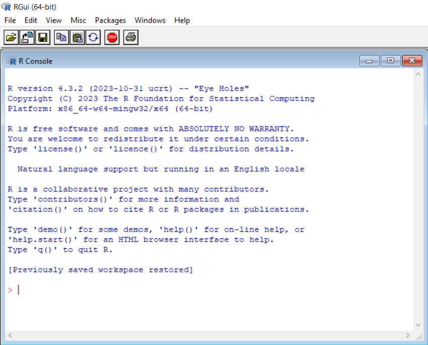
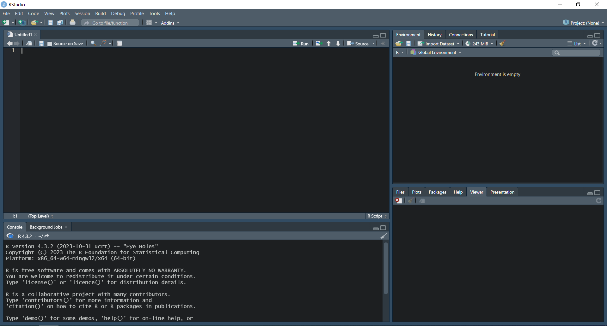

# R ve R Studio

## R Nedir?

R istatistiksel hesaplamalar da yapabilen bir programlama dilidir. Bell Telephone Laboratories’te (AT&T şirketinin bir parçasıdır) John Chambers ve arkadaşları tarafından geliştirilen S dilinin açık kaynak kodlu halidir. Bu, S dilinin geliştirilmesi ile istatistiksel analizlerin kolaylaşması amaçlanmıştır. Ancak, bu dilin yaygınlaşması Chambers’ın yazdığı, “yeşil kitap” olarak da bilinen kılavuz kitabın (Chambers, 1998) basılmasından sonra hızlanmıştır (Peng, 2022). R da, bu S dilinin geliştirilmiş bir versiyonu olarak düşünülebilir. 1990’lı yıllarda Auckland Üniversitesinde Ross Ihaka ve Robert Gentleman tarafından geliştirilen R’ın ilk profesyonel sürümü 29 Şubat 2000 tarihinde piyasaya sürülmüştür. Buna karşın, yazılım 1996 yılındaki yayın aracılığıyla kamu ile paylaşılmıştır (Ihaka ve Gentleman, 1996). Bu sürümler düzenli olarak güncellenmektedir. R ve Temel Geliştirme Takımı (R Core Team) R’ı geliştirmeye devam etmektedir. R yazılımı Genel Kamu Lisansı (GNU-General Public Licence) koşulları altında ücretsiz servis edilmektedir. Bunun dışında pek çok geliştirici, paketler hazırlayarak R’ın gelişmesine katkı sunabilmektedir.

## Neden R?

R, yazılım dilleri arasında, özellikle istatistiksel analizler açısından ön plana çıkmaktadır. R’ın yaygın olarak tercih edilmesinde pek çok etken rol oynamaktadır. R’ın geliştirilmesinde katkıları bulunan Hadley Wickham’ın R’da güçlü bulduğu ve R’ı tercih etmesinde rol oynayan özelliklerden bazıları şunlardır (Wickham, 2019):
<li>R, ücretsiz ve açık kaynak kodludur.</li>
<li>R ile ilgili çalışmalar yürüten geniş topluluklar bulunmaktadır. Bu toplulukların desteği oldukça önemlidir.</li>
<li>R’da istatistiksel modelleme, makine öğrenmesi, veri içe-dışa aktarımı, veri işleme veya veri görselleştirme ile ilgili pek çok paket mevcuttur. Özel gereksinimler için geliştirilen çok sayıda paket kodlamaya yardımcı olmaktadır.</li>
<li>R’da pek çok farklı formatta çıktı alınabilmektedir. Bu çıktılar aracılığı ile diğer insanlara çalışmalarınızı çeşitli şekillerle gösterebilirsiniz.</li>
<li>RStudio isimli tümleşik geliştirme ortamı sayesinde veri bilimi, istatistiksel modelleme ve veri görselleştirme ihtiyaçları oldukça güzel şekilde karşılanabilmektedir.</li>
<li>Akademik çalışmalarda kullanılmak üzere paketler geliştirme imkanı bulunmaktadır. Böylelikle araştırmacılar yayınlarına eşlik edecek bir paket ile son gelişmeleri okurlarla buluşturabilmektedir.</li>
<li>R ile C, Fortran, C++ gibi yüksek performanslı programlama dillerine kolay bir şekilde bağlanılabilmektedir.</li>
Bunlara ek olarak R'ın başka pek çok güçlü yönü bulunmaktadır. Örneğin, R yazılımı Windows, macOS ve Linux işletim sistemlerinde çalışabilmektedir. R bir veri tabanı değildir, ancak veri tabanlarına erişebilir. R'da kullandığınız bir paketteki fonksiyon, istediklerinizi tam olarak karşılayamıyor olsa bile, bu fonksiyonda düzenlemeler yaparak her türlü analiz ihtiyacınızı karşılayabilirsiniz. R için geliştirilmiş paketlerin oldukça detaylı açıklamalar içeren dokümanları bulunmaktadır. En geniş anlamda, R yalnızca istatistiksel işlemler yapmanın daha da ötesinde programlamaya da imkan veren oldukça kapsamlı bir yazılımdır.

## R'ı İndirme ve Kurma

R, yalnızca iki adımda bilgisayarınıza kurulabilir.
  
1. Öncelikle Comprehensive R Archive Network (CRAN) [web sitesine](https://cran.rstudio.com/) gidiniz ve bilgisayarınızın işletim sistemini seçiniz. Karşınıza çıkan linklerden uygun olanını seçerek indirme işlemini gerçekleştiriniz (Windows için örneğin, "install R for the first time" seçilecektir).
  
2. İnen .exe dosyasını çalıştırarak, standart program kurma aşamalarını onaylayarak R'ı bilgisayarınıza kurunuz.

İşlemler gerçekleştirildikten sonra R artık bilgisayarınıza yüklenmiş olacaktır. Programı çalıştırdığınızda aşağıdaki gibi bir ekran ile karşılaşacaksınız.

{width="200%"}

Bu, R'ın ana ekranıdır. Program bu haliyle kullanılabilir. Ancak, pek çok kişi R programını bir tümleşik geliştirme ortamında (IDE) kullanmaktadır. Bu, yeni bir yazılımın kurulmasını gerektirmektedir. Pek çok farklı IDE bulunmasına rağmen, R için en sık kullanılan IDE, POSIT tarafından sunulan RStudio'dur. RStudio, sunduğu pek çok özellik sayesinde R'ın kullanımını kolaylaştırmaktadır. Bu nedenle, bu kitapta da yüklenmesi önerilmektedir.

## RStudio Nedir?

RStudio, açık kaynak kodlu bir tümleşik geliştirme ortamıdır (IDE) ve programlamayı kolaylaştıran pek çok özellik içerir. RStudio, R kullanıcıları için genel olarak 4 panelden oluşan bir görüntü sunar. Bu paneller, R konsolu (console), kod editörü (source), çalışma alanına ilişkin bilgiler sunan bir panel ve çıktılara ilişkin bilgiler sunan bir başka paneldir. RStudio'yu bilgisayarınıza kurduğunuzda şöyle bir görüntü ile karşılaşırsınız.

{width="200%"}

Görselden görüldüğü gibi RStudio'da 4 farklı panel bulunmaktadır. Bu panellerde hangi özelliklerin bulunacağı kullanıcı tarafından düzenlenebilir. Dahası, bu görüntü benim RStudio'yu kullanma şeklimi göstermektedir. Siz, eğer ilk defa RStudio'yu bilgisayarınızda açarsanız beyaz ağırlıklı bir tema ile karşılaşacaksınız.

## RStudio'yu İndirme ve Kurma

RStudio da iki adımda bilgisayarınıza kurulabilir.
  
1. Öncelikle POSIT'in web sitesinden [RStudio Desktop](https://posit.co/download/rstudio-desktop/) linkine gidilmelidir. Burada RStudio, eğer bilgisayarınızda R yoksa ilk olarak bunu indirmenizi söylemektedir (Sol tarafta Install R yazar). Eğer R zaten bilgisayarınızda mevcut ise sağ taraftaki (Install RStudio) düğmeye tıklayarak RStudio'yu kurmak için gerekli .exe dosyasını indiriniz.
  
2. İnen .exe dosyasını çalıştırdıktan sonra standart program kurma aşamalarını onaylayarak RStudio'yu bilgisayarınıza kurunuz.