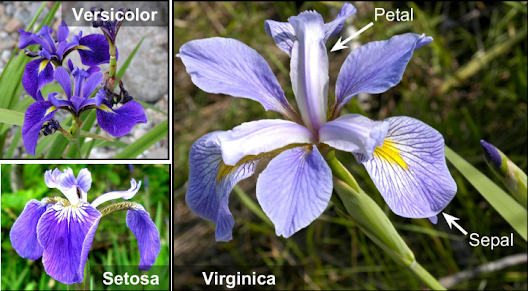

# Veri Yapıları

R'da pek çok veri yapısı mevcuttur. Bu kitapta özellikle vektörler, faktörler, matrisler, diziler, listeler ve data frame'lere yer verilmiştir.

## Vektörler (vectors)

Vektör, aynı tür verilerin bir araya gelmesiyle oluşan tek boyutlu bir veri yapısıdır. Vektörler sayısal, karakter ya da mantıksal verilerden oluşabilir. R'da vektörleri oluşturmak için <code>c()</code> fonksiyonu kullanılabilir.

```{r}
# üç farklı veri türünde vektör nesnelerin oluşturulması
sayisal <- c(5, 10, 15)
karakter <- c("x", "y", "z")
mantiksal <- c(TRUE, FALSE, TRUE)

# farklı tür veriler birleştirilirse ne olur
ornek1 <- c(30, "k", 5, "c")
ornek1
class(ornek1)

# farklı tür veriler birleştirilirse ne olur
ornek2 <- c(2, 5, TRUE, FALSE)
class(ornek2)

ornek3 <- c(2, 5, "Ankara")
class(ornek3)
```

Farklı tür veriler birleştirildiğinde genellikle karakter vektörleri elde edilir (`ornek3` nesnesi gibi). Buna karşın TRUE, FALSE birer eleman olarak vektöre eklenirse, bunlar sırası ile 1 ve 0 olarak davranır. Bu nedenle `ornek2` nesnesi nümerik bir vektördür. Yukarıda verilen `sayisal`, `karakter` ve `mantiksal` nesneleri de birer vektördür. Vektörlerin uzunlukları <code>length()</code> fonksiyonu ile bulunabilir. Vektör türlerine ise <code>typeof()</code> fonksiyonu ile bakılabilir.

```{r}
# iki ayrı vektörün oluşturulması
sinif <- c("Yagiz", "Deniz", "Doruk", "Cagan", "Utku", "Sarp")
notlar <- c(90, 95, 100, 80, 90, 95)

# vektörün uzunluğunu bulmak için
length(sinif)
length(notlar)

# vektörün türünü bulmak için
typeof(sinif)
typeof(notlar)
```

## Faktörler (factors)

Faktörler kategorik/kesikli/süreksiz veriler için kullanılır. Faktör nesnelerinin aldığı değerlere düzey (level) denir. Karakter veri türü çoğunlukla grafiklerin adlandırılması, satır veya sütun adlarının verilmesi gibi amaçlar ile kullanılırken, faktörler veri setindeki süreksiz değişkenleri (variables) gösterir. Faktörler analizlerde grupları gösterir. Faktörler karakter veri türünde ya da sayısal veri türünde olabilir.

```{r}
# bir karakter vektörü oluşturma ve bunu faktöre dönüştürme
cinsiyetler <- c("erkek", "erkek", "erkek", "kadin", "erkek", "kadin", "kadin")
cinsiyetler <- factor(cinsiyetler)
cinsiyetler
```

Faktörler düzeylerine göre sıralanabilir. Bunun için <code>ordered()</code> fonksiyonu kullanılabilir.

```{r}
# bir karakter vektörü oluşturma ve bunu düzeyleri olan bir faktöre dönüştürme
beden <- c("M", "M", "S", "S", "L")
beden <- ordered(beden, levels = c("S", "M", "L"))
beden
```

Yukarıdaki örnekte bedenler sırasıyla 'small', 'medium' ve 'large' olarak sıralanmıştır.

## Matrisler (matrices)

Matrisler, vektörler gibi tek bir tür veri içerir. Buna karşın, vektörler tek boyutlu iken  matrisler iki boyutlu veri yapılarıdır. Matris oluşturmanın birden fazla yolu vardır. Eşit uzunluktaki vektörler birleştirilerek matris oluşturulabilir. Sütunların birleştirilmesi için <code>cbind()</code>, satırların birleştirilmesi için <code>rbind()</code> fonksiyonları kullanılır.

```{r}
# öğrencilerin boyları için bir vektör, kiloları için başka bir vektör oluşturma
ogrenci_boy <- c(162, 168, 175, 182, 140)
ogrenci_kilo <- c(48, 50, 52, 55, 48)

mm_1 <- cbind(ogrenci_boy, ogrenci_kilo)
mm_1
mm_2 <- rbind(ogrenci_boy, ogrenci_kilo)
mm_2
class(mm_1) ; class(mm_2)
```

<code>byrow</code> argümanına dikkat ederek matris oluşturulabilir.

```{r}
matrix(1:20, nrow = 4, ncol = 5, byrow = F)
matrix(1:20, nrow = 4, ncol = 5, byrow = T)
matrix(1:20, nrow = 4)
matrix(1:20, ncol = 5)
```

Yukarıdaki örnekten de anlaşılacağı üzere `byrow` argümanının olağan değeri `FALSE` (ya da kısaca `F`) şeklindedir. Bu argüman yazılmadan `matrix()` fonksiyonu kullanıldığında, argüman sanki `FALSE` olarak girilmiş gibi matris oluşturulacaktır. Bu argüman ile 1'den 20'ye kadar olan tam sayıların satırlar bazında mı sütunlar bazında mı sıralacağı R'a söylenmiş olur.

## Diziler (arrays)

Diziler, vektörlerin ve matrislerin genelleştirilmiş halidir. Vektörler tek, matrisler ise iki boyutlu dizilerdir. Diziler, tek tür veri içerebilir. Dizi oluşturmak için <code>array()</code> fonksiyonundan yararlanılır.

```{r}
# boş bir dizinin oluşturulması
array(data = NA, dim = length(data), dimnames = NULL)

array(1:24, dim = c(2, 3, 4))

vektor_a <- c(5, 9, 3)
vektor_b <- c(10, 11, 12, 13, 14, 15)
sonuc <- array(c(vektor_a, vektor_b), dim = c(3, 3, 2))
sonuc
```

## Listeler (lists)

Listeler vektörlere benzer ancak vektörlerden farklı olarak herhangi bir veri türünde veri içerebilir. Esnek bir veri yapısıdır. Listelerde hem farklı türden, hem de farklı uzunlukta veriler yer alabilir. Listeler <code>list()</code> fonksiyonu ile oluşturulabilir.

```{r}
# bir listeye koymak için üç ayrı vektör oluşturma
ad <- c("Ad1", "Ad2", "Ad3", "Ad4", "Ad5", "Ad6")
boy <- c(180, 181, 188, 170, 172, 175, 181)
kilo <- c(80, 85, 55)

# üç vektörden oluşan bir liste oluşturma
liste <- list(ad, boy, kilo)
liste

# liste'nin yapısının incelenmesi
str(liste)

# liste isimli listeye iki vektör daha ekleme
liste2 <- list(liste, ilk3sayi = c(1, 2, 3), mantik = c(T, F, F, F, T))
liste2

# liste2'nin yapısının incelenmesi
str(liste2)
```

## Data Frame'ler

R'da data frame'ler <code>data.frame()</code> fonksiyonu ile oluşturulabilir. R'a farklı programlardan aktarılan veriler genelde data frame olarak kaydedilir. Bu data frame'ler matrislere çok benzer, ancak data frame'lerde farklı sütunlarda yer alan veriler farklı türlerde olabilir. Matrislerde tüm veriler aynı tür olmak zorundadır. Data frame kavramı farklı kaynaklarda veri seti ya da veri çerçevesi olarak çevrilmiştir. Ancak bu kitapta orijinal haliyle kullanılmıştır. Bu şekli ile kullanımına yazılım ile ilgili yabancı dildeki kaynaklarda sıklıkla rastlanılmaktadır.

```{r}
# süper lig 2022-2023 sezonunun sonuç tablosundaki ilk 6 takımdan oluşan data frame'i oluşturalım
takim <- c("galatasaray", "fenerbahce", "besiktas", "adana demirspor", "basaksehir", "trabzonspor")
gol <- c(83, 87, 78, 76, 54, 64)
puan <- c(88, 80, 78, 69, 62, 57)

dataFrame1 <- data.frame(takim, gol, puan)
dataFrame1
```

Uzunlukları farklı olan vektörlerle data frame oluşturmaya çalışılırsa, kısa vektör uzun vektör uzunluğunda tekrar edecektir. Uzun vektörün uzunluğu kısa vektörün uzunluğunun bir katı değilse hata mesajı alınacaktır.

```{r, error = TRUE}
x <- 100:103
y <- 10
M <- c(10, 11)
N <- c(4, 5, 6)

# x dört; y ise bir elemanlıdır
data.frame(x, y)
# x dört; N ise üç elemanlıdır
data.frame(x, N)
# M iki; N ise üç elemanlıdır
data.frame(M, N)
```

Data frame'i bir tablo olarak görmek için <code>View()</code> fonksiyonu kullanılır.

```
View(dataFrame4)
```

### R'daki Hazır Veri Setleri

#### iris

`iris` veri seti, R’daki en meşhur veri setlerinden biridir. Sıklıkla veri görselleştirmenin ya da sınıflamanın gösterilmesi amacıyla kullanılmaktadır. Veriler, İngiliz istatistikçi ve biyolog Ronald Fisher tarafından toplanmıştır. Bazı kaynaklarda bu veri seti Edgar Anderson’un ya da Ronald Fisher’ın iris veri seti şeklinde geçmektedir. Bu veri setinde iris isimli çiçeğin 3 farklı türüne (setosa, versicolor ve virginica) ait dört farklı değişken yer almaktadır. Bu dört değişken bitkilerin yapraklarının (petal ve sepal) genişlik ve uzunluklarını vermektedir. Her türden 50 adet çiçeğin bilgisi veri setinde yer almaktadır. Bu bilgilerden hareketle iris’lerin türü tahmin edilmeye çalışılmaktadır. Bahsi geçen bitki şudur:

<center>{width="150%"}</center>

Veri setinin ilk 10 satırı şu şekilde incelenebilir:

```{r}
data(iris)
head(iris, 10)
```

#### mtcars

`mtcars`, R’da özellikle veri görselleştirme uygulamaları için yaygın olarak kullanılan bir başka veri setidir. Bu veriler 1974 yılı Motor Trend US tarafından derlenmiştir. 32 aracın 11 farklı özelliğini ifade eden değişkenlere sahiptir. Bu değişkenlerin tamamı nümeriktir. Veri setinin ilk 10 satırı şu şekilde incelenebilir:

```{r}
data(mtcars)
head(mtcars, 10)
```

#### penguins

`penguins` veri seti `palmerpenguins` paketinin içindeki bir veri setidir. Veriler, bilim insanları tarafından toplanmış ve Antartika’daki Palmer Archipelago’da yaşayan 3 farklı penguenin özelliklerine ilişkin bilgiler içermektedir. Bu 3 penguen türü şunlardır:

<center>{width="150%"}</center>

Veri setinde bu üç tür penguene ilişkin tür, bulunduğu ada, gaga uzunluğu, gaga derinliği, yüzgeç uzunluğu, kütle, cinsiyet ve yıl değişkenleri bulunmaktadır (Not: gaga uzunluğu olarak kısaltılan bilgi aslında gagasının üst sırtı olarak ifade edilen bölgenin uzunluğudur). Toplam 344 satır ve 8 sütundan oluşmaktadır. Aşağıdaki görselde bu bilgilerden bazıları yer almaktadır.

<center>{width="150%"}</center>

Görüldüğü üzere, eğlenceli bir veri setidir ve genellikle veri görselleştirme uygulamalarında kullanılmaktadır. Bu veri setine ulaşmak için öncelikle `install.packages(“palmerpenguins”)` komutu ile paket indirilmelidir. Ardından aşağıdaki satır komutları ile veri setinin ilk 10 satırı incelenebilir:

```{r}
library(palmerpenguins)
head(penguins, 10)
```

#### Titanic

`Titanic` veri seti R’ın kurulumu ile birlikte gelen veri setlerinden biridir. Daha doğrusu, bu set aslında doğrudan bir data frame değildir. İlk çağrıldığında ‘table’ formatında gelmektedir. Bu formattaki veri seti 4 boyutlu bir çapraz tablo şeklindedir. 4 değişkene ilişkin 2201 gözlem içermektedir. Bazı düzenlemelerin ardından bildiğimiz anlamda veri setine çevrilebilir. Bu veri setinde, tarihte bilinen bir gemi kazasının verisi bulunmaktadır. Düzenleme yapılmasının ardından elde edilen veri setinde ekonomik sınıf, cinsiyet, yaş, hayatta kalıp-kalamama durumu ve frekans sütunları yer alacaktır. Bu veri seti sıklıkla makine öğrenmesi (sınıflandırma temelli algoritmalar) uygulamaları için kullanılmaktadır. Verinin R’a indirilmesi ve gerekli düzenlemelerin yapılması şu şekilde gerçekleşmektedir.

```{r}
# veri setinin çağırılması
data(Titanic)

# veri setinin istenen formata getirilmesi
library(tibble)
Titanic <- as_tibble(Titanic)
```

Bu işlemlerin ardından `Titanic` veri seti oluşacaktır. Veri setinin ilk 10 satırı şu şekilde incelenebilir:

```{r}
head(Titanic, 10)
```

#### airquality

`airquality`, R’da özellikle zaman serileri ve regresyon analizi çalışmalarını örneklendirmek amacıyla kullanılan bir veri setidir. Bu veri setinde New York'un hava kalitesine ilişkin bilgiler bulunmaktadır. 153 satır ve 6 sütundan oluşan veri setinde satırlarda Mayıs 1973'ten Eylül 1973'e kadar ölçümlenen değerler bulunmaktadır. Bu veri setinde kayıp değerler de bulunmaktadır. Bu nedenle kayıp değer analizlerini örneklendirmek amacıyla da kullanılabilirdir. Veri setinin ilk 10 satırı şu şekilde incelenebilir:

```{r}
data(airquality)
head(airquality, 10)
```

#### verbal

`verbal` veri seti, Vansteelandt’ın (2000) tarafından tez çalışması için toplanmıştır. Bu veri setinin adı ‘Verbal Aggression’dır. Verbal Aggression veri seti “difR” ve “deltaPlotR” paketlerinde hazır olarak sunulmaktadır. Bu veri seti 243 kadın ve 73 erkeğin yanıtlarından (toplam 316 kişi) oluşmaktadır. Veri seti bir matris şeklindedir, 316 satır ve 26 sütundan oluşmaktadır. Sütunlarda 24 adet maddeden alınan puanlar, toplam puanın alındığı ‘Anger’ ve grup değişkeni olan ‘Gender’ yer almaktadır.
Maddeler şu ifadeler ile açıklanmıştır.
<li>S1: A bus fails to stop for me.</li>
<li>S2: I miss a train because a clerk gave me faulty information.</li>
<li>S3: The grocery store closes just as I am about to enter.</li>
<li>S4: The operator disconnects me when I had used up my last 10 cents for a call.</li>
Her madde S harfi ile başlamaktadır. S harfinin yanında 1’den 4’e kadar bir ifadeler gelmektedir. Ardından Want (yapmak isterim) ve Do (yaparım) şeklindeki karşılık verme ifadeleri gelmektedir. Son olarak ise olası tepkiler listelenmektedir: Curse, Scold ve Shout.
Örneğin, S2WantCurse maddesinden 1 puan alan bir birey, “bir görevli kendisine hatalı bilgi verdiği için treni kaçırdığında lanetlemek istemektedir.” şeklinde bir yorum yapılabilir. Bu örnek veri seti sıklıkla psikometri alanında yaygın bir şekilde kullanılan DMF analizlerini örneklemek için kullanılabilir. Veri setine ulaşmak için öncelikle `install.packages("difR")` komutu ile paket indirilmelidir. Ardından veri setinin ilk 5 satırı şu şekilde incelenebilir:

```{r}
library(difR)
data(verbal)
head(verbal, 5)
```

## Veri Yapıları Arasında Dönüşüm

### as.list()

```{r}
sayilar <- c(10, 11, 12, 13, 17, 20)
sayilar
as.list(sayilar)
sayilar2 <- 1:6
yeni_sayilar <- data.frame(sayilar, sayilar2)
yeni_sayilar
as.list(yeni_sayilar)
```

### as.data.frame()

```{r}
sayilar <- c(10, 11, 12, 13, 17, 20)
sayilar
as.data.frame(sayilar)
```

### as.matrix()

```{r}
yeni_vektor <- 1:50
as.matrix(yeni_vektor)
yeni_sayilar
as.matrix(yeni_sayilar)
```

### as.vector()

```{r}
yeni_sayilar
as.vector(yeni_sayilar)
```

## Alıştırmalar `r fontawesome::fa('pencil',fill='gray')`

**Alıştırma 1**
Elemanları “a”, “b” ve “c” olan, 3 elemanlı, ismi `ilk3harf` olan bir vektör oluşturunuz.


<details>
  <summary>Yanıt İçin Tıklayınız `r fontawesome::fa('circle-arrow-down',fill='gray')`</summary>

```{r} 
ilk3harf <- c("a", "b", "c")
```

</details>

**Alıştırma 2**
`bolum <- c(“egitimde”, “olcme”, “ve”, “degerlendirme”)` satır komutunu çalıştırınız. Oluşan `bolum` isimli
vektörün uzunluğunu (eleman sayısını) hesaplayınız.

<details>
  <summary>Yanıt İçin Tıklayınız `r fontawesome::fa('circle-arrow-down',fill='gray')`</summary>

```{r} 
bolum <- c("egitimde", "olcme", "ve", "degerlendirme")
length(bolum)
```

</details>

**Alıştırma 3**
`not <- c(80, 80, 85, 90, 55, 90, 70, 65)` satır komutunu çalıştırınız. `not` isimli vektördeki değerlerin ortalamasını, standart sapmasını, maksimum ve minimum değerlerini hesaplayınız.

<details>
  <summary>Yanıt İçin Tıklayınız `r fontawesome::fa('circle-arrow-down',fill='gray')`</summary>

```{r} 
not <- c(80, 80, 85, 90, 55, 90, 70, 65)
mean(not)
sd(not)
max(not)
min(not)
```

</details>

**Alıştırma 4**
`beden <- c("M", "M", "S", "S", "L", "S", "M", "L")` satır komutunu çalıştırarak bir vektör oluşturunuz. Ardından bu vektörün S < M < L sıralamasına uyacak şekilde bir faktör olmasını sağlayınız (`ordered()` fonksiyonundan yararlanınız).

<details>
  <summary>Yanıt İçin Tıklayınız `r fontawesome::fa('circle-arrow-down',fill='gray')`</summary>

```{r} 
beden <- c("M", "M", "S", "S", "L", "S", "M", "L")
beden <- ordered(beden, levels = c("S", "M", "L"))
beden
```

</details>

**Alıştırma 5**
1'den 20'ye kadar olan sayılar ile 4 satırlı, 5 sütunlu bir matris oluşturunuz. Oluşturulan matriste satır toplamlarını ve sütun ortalamalarını bulunuz.

<details>
  <summary>Yanıt İçin Tıklayınız `r fontawesome::fa('circle-arrow-down',fill='gray')`</summary>

```{r} 
matrisA <- matrix(1:20, nrow = 4, ncol = 5)
rowSums(matrisA)
colMeans(matrisA)
```

</details>

**Alıştırma 6**
Bir adet matris, bir adet karakter vektörü, bir adet de nümerik vektör içeren, 3 elemanlı, adı `liste1` olan bir liste oluşturunuz.

<details>
  <summary>Yanıt İçin Tıklayınız `r fontawesome::fa('circle-arrow-down',fill='gray')`</summary>

```{r} 
m1 <- matrix(1:10, 2, 5)
uni <- c("ondokuzmayis", "hacettepe", "ankara")
sira <- seq(from = 1, to = 20, by = 4)

liste1 <- list(m1, uni, sira)
```

</details>