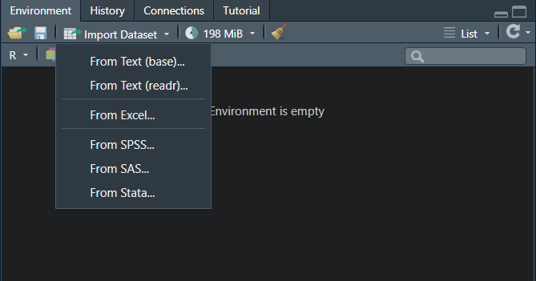
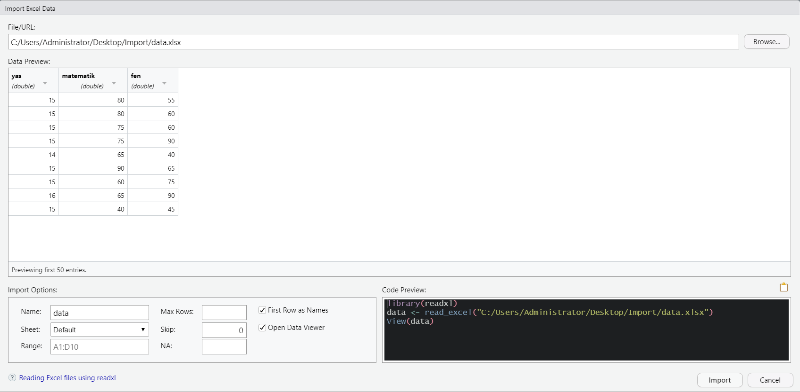
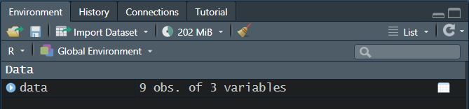
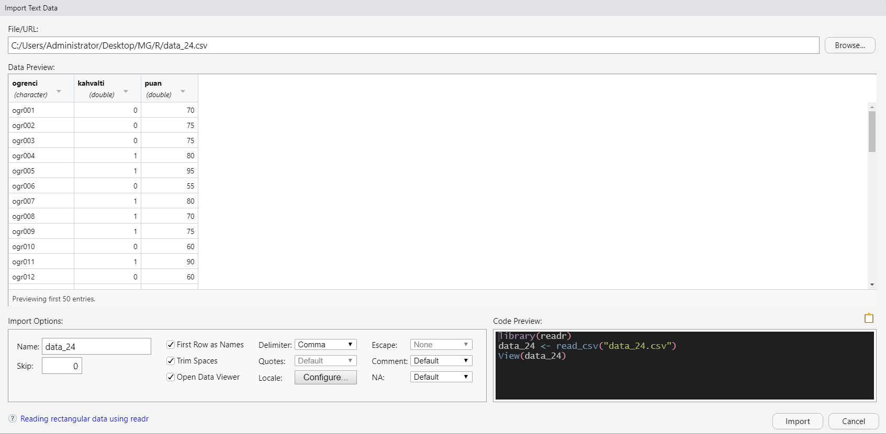
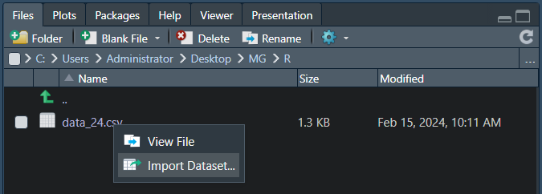
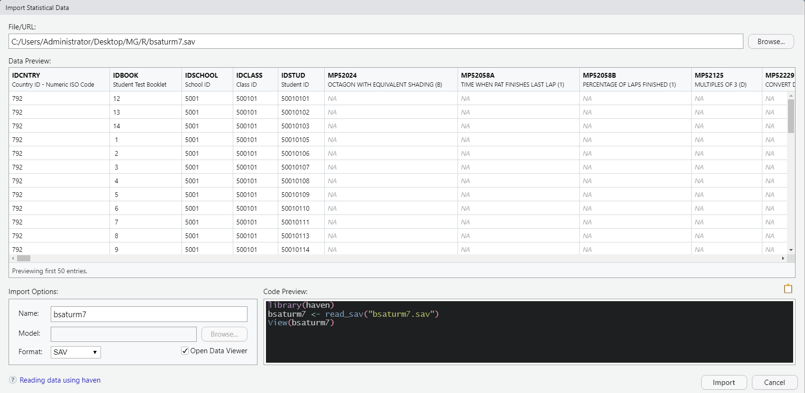
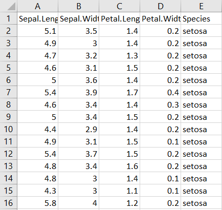

# Veriyi İçe ve Dışa Aktarma

## İçe Aktarma

R’da veriler ile çalışmalar yürütmek için verileri içe aktarmak (import) gerekebilir. Bunun için pek çok alternatif yol bulunmaktadır. Bu kitapta özellikle iki yol ele alınacaktır. Bunlardan birincisi RStudio’nun sunduğu bir imkan olan Environment kısmındaki ‘Import Dataset’ menüsü, diğeri ise fonksiyonlar aracılığı ile içe aktarma olacaktır. Ek olarak, içe aktarılacak veri setleri pek çok farklı formatta olabilir (örneğin, .xlsx, .csv, .sav, .txt gibi). Bu kitapta yaygın olarak karşılaşılan .xlsx, .csv, .sav ve .txt formatındaki dosyalar örneklendirilmiştir.
Excel belgesi olarak bilgisayarımızda kayıtlı olan bir belgeyi (veri seti) R’a aktarmak için öncelikle Environment kısmındaki ‘Import Dataset’e tıklarız.

<center>{width="200%"}</center>
 
Burada karşınıza birkaç seçenek çıkacaktır. Belgenin türüne göre bunlardan biri seçilebilir. Bu örnekte bir .xlsx belgesi kullanıldığı için ‘From Excel…’ seçilmiştir. Bu işlem gerçekleştirildikten sonra ekrana bir diyalog paneli açılacaktır. Bu panelde ‘Browse…’ tıklanarak yüklenecek veri belgesi seçilmelidir. Bu seçim gerçekleştikten sonra ekranda bir veri ön izlemesi (Data Preview) belirecektir.

<center>{width="200%"}</center>

Bu kısımda bazı ayarlamaların yapılması gerekebilir. Veri ön izlemesi yapmak önemlidir. Örneğin veri setinizin ilk satırında değişken isimleri var mı? Veri seti Excel belgesinde ise bu veri Excel’in ilk sayfasında (sheet) mı? Veri ön izlemesindeki değerler R tarafından doğru olarak sınıflandırılmış mı? Bu örnekte veri setinin ilk satırında değişken isimleri yer almaktadır ve veri ön izleme penceresinde R’ın bu satırı doğru bir şekilde ele aldığı görülmektedir. Ancak sizin uygulamanızda eğer ilk satırda değişken isimleri yer almıyorsa, altta yer alan ‘First Row as Names’ seçeneğinin işaretini kaldırmanız gerekir. Bu örnekte, veri seti tek bir sayfa içeren bir Excel belgesinde saklanmaktadır. Bu nedenle bir düzenleme yapılması gerekmemektedir. Eğer Excel belgenizin başka bir sayfasındaki veriyi R’a aktarmak isterseniz ‘Sheet’ kısmından sayfayı seçmeniz gerekir. Son olarak, veri setinde örnek veri setinde 3 değişken bulunmaktadır. Bunların tamamı sayısal değerlerdir. Bu nedenle R bu sütunları ‘double’ olarak işaretlemiştir. Bu da yine doğru bir sınıflamadır. R, veri setinizdeki her bir sütundaki değerler için doğru sınıflama yapmaya çalışır. Ancak, karmaşık bir veri seti için ‘Data Preview’ ekranındaki değişken sınıflamalarını kontrol etmekte yarar vardır. Bu bazen önemli bir uyarı olabilir. Örneğin, tamamen sayısal değerlerden oluşan bir sütunda birkaç kayıp veri bulunabilir. Siz ya da veriyi toplayan kişiler kayıp değerler yerine ‘boşluk’, ‘kayıp’, vb. kelimeler kullanmış olabilir. Bu durumda bu kelimeler R için karakterler olduğu için sütun karakter türünde içe aktarılabilir. Veriyi içe aktardıktan sonra örneğin bazı matematiksel işlemleri bu sütun (değişken) için gerçekleştiremeyebilirsiniz. Çünkü bu sütun nümerik değildir. Bu ciddi bir sorun değildir. İçe aktarma işlemini gerçekleştirdikten sonra da değişkenlerinizi sınıflandırabilirsiniz. Ancak, veriyi içe aktarırken bir göz atmak yararlı olabilir.
İçe aktarma işleminin gerçekleştirildiği diyalog panelinin sağ alt tarafında bazı komutlar dikkatinizi çekmiştir. Bu komutlar, aslında R’ın içe aktarmayı nasıl yaptığını göstermektedir. Yani buradaki satır komutlarını alıp, çalışma ekranınıza yapıştırıp çalıştırarak da veri içe aktarmayı gerçekleştirebilirsiniz. Bu örnekteki satır komutları şu şekildedir:

```
library(readxl)
data <- read_excel("C:/Users/Administrator/Desktop/Import/data.xlsx")
View(data)
```

Üç adımda şunların gerçekleştirildiğini anlayabiliriz: (1) .xslx formatındaki veri seti içe aktarılırken `readxl` isimli paketin çalıştırılması gerekmektedir. (2) Bu paket içindeki `read_excel()` fonksiyonu kullanılarak çalışma alanında `data` isimli nesne oluşturulmaktadır. (3) `View()` fonksiyonu kullanılarak içe aktarılan veri setinin bir görüntüsü ekrana getirilmektedir.
İşlem diyalog panelini kullanarak ya da satır komutları kullanılarak gerçekleştirildikten sonra artık çalışma alanında `data` isimli nesne oluşacaktır. Bu nesne, data frame'in özel bir hali olan tibble formatında olacaktır. Artık Environment kısmındaki veri setimizi görebiliriz. Bu veri seti 3 değişkenden ve 9 gözlemden oluşmaktadır. Ayrıca veri setinin isminin (data) solundaki ok işaretine tıklayarak içindeki değişkenleri ve değişkenlerin sınıflarını da inceleyebiliriz. Sağ taraftaki tablo simgesine tıklandığında ise veri seti görüntülenecektir.

<center>{width="200%"}</center>

Aynı yöntem ile CSV (comma-delimited values) formatında bir veri setini R’a aktaralım. Bunun için yine Environment kısmındaki ‘Import Dataset’e tıklarız. Buradan sonra From Text (readr)… seçeneğini tıklarız. Bu işlemin ardından yine karşımıza bir diyalog paneli (Import Text Data) çıkacaktır.

<center>{width="200%"}</center>

İşlemlerin mantığı aynıdır. Veri ön izlemesinde bir sorun görünüyorsa düzenlemeler yapılması gerekmektedir. Örneğin ilk sütun değişken isimlerini içermiyorsa ‘First Row as Names’ seçeneği iptal edilmelidir. Bunun yanı sıra, CSV dosyalarının içe aktarımındaki en önemli konu olan değişken değerlerinin (values) hangi ayırıcı ile ayrıldığıdır. Bu örnekte, virgül (`,`) ile birbirinden ayrılarak kayıt altına alınan değerler bulunduğu için Delimiter kısmında Comma yazmaktadır. Bunun dışında veriler birbirinden boşluklarla ya da noktalı virgül (`;`) işareti ile de ayrılmış olabilir. Buna dikkat edilmelidir. Böyle bir durum söz konusu ise Delimiter kısmında gerekli seçim yapılmalı ve ardından Import denilmelidir.
Diyalog panelinin sağ alt tarafında yine bazı kodlar görülmektedir. Bu kodlar/komutlar, içe aktarma için ayarlar yaptıkça değişmektedir. Bu komutlar, aslında R’ın içe aktarmayı nasıl yaptığını göstermektedir. Buradaki satır komutlarını alıp, çalışma ekranınıza yapıştırıp çalıştırarak da veri içe aktarmayı gerçekleştirebilirsiniz. Bu örnekteki satır komutları şu şekildedir:

```
library(readr)
data_24 <- read_csv("data_24.csv")
View(data_24)
```

Bir önceki örnekten farklı olarak bu sefer `readr` paketinden yardım alınmıştır. Ayrıca `read_csv()` fonksiyonun içinde dosya yolu uzun uzun yazılmamış, bunun yerine yalnızca veri dosyasının ismi yazılmıştır. Bunun nedeni, bu örnekte kullanılan R script’i için bir çalışma dizininin (working directory) önceden belirlenmiş olmasıdır. Siz de çalışmalarınızda çalışma dizinlerini önceden belirleyerek R’ın ilgili klasördeki dosyalara daha kolay erişmesini sağlayabilirsiniz.
Hazır çalışma dizininden bahsetmişken kitaplarda pek örneklendirilmeyen bir başka yöntemle de veri içe aktarılabilir. Eğer projenize/çalışmanıza başlamadan önce bir çalışma dizini belirlerseniz (Session -> Set Working Directory -> Choose Directory…) RStudio’nun ekranında sağ alt tarafta (genellikle) yer alan Files sekmesinden de veriyi içe aktarabilirsiniz. Tabi bunun için veri setinin çalışma dizininin içinde yer alması gerekmektedir. Bunun için Files sekmesi açık iken veri setinizin üzerine fare ile bir kez sol tıklama yapmalı ve ardından Import Dataset… demelisiniz. Bunu yapınca yine az önceki Import Text Data diyalog paneli açılacaktır.

<center>{width="200%"}</center>

Az önce bahsedilen ayarlar ile verinizi içe aktarabilirsiniz.
SPSS veri dosyaları .sav formatında kaydedilmektedir. R’da .sav formatındaki veri dosyaları `haven` isimli paket yardımıyla içe aktarılmaktadır. Örnek olarak, [TIMSS 2019](https://timss2019.org/international-database/) uygulamasının veri setini R’a aktaralım. Bunun için Environment kısmındaki ‘Import Dataset’e tıklarız. Buradan sonra From SPSS… seçeneğini tıklarız. Bu işlemin ardından karşımıza bir diyalog paneli (Import Statistical Data) çıkacaktır. Browse… dedikten sonra verimizi ilgili klasörden bularak seçeriz.

<center>{width="200%"}</center>

Görselden görüldüğü üzere veri seti oldukça derli topludur. Doğrudan Import denerek R’a aktarılabilir. Sağ taraftaki kodlardan anlaşılacağı üzere sırası ile önce `haven` paketi çalıştırılması istenmiş, ardından bu paketin içindeki `read_sav()` fonksiyonu ile `bsaturm7` isimli nesnenin oluşturulması ve son olarak bu nesnenin görüntülenmesi (`View()`)istenmiştir. Yani bu kısımdaki satır komutları alınarak çalışma ekranında çalıştırıldığında da menüler aracılığı ile gerçekleştirilen içe aktarma işlemi gerçekleştirilebilecektir.
İçe aktarmak istediğiniz veriler .txt formatındaki metin dosyaları da olabilir. Bu durumda yine pek çok seçeneğiniz olduğu gibi bu örnekte bir fonksiyon aracılığı ile veriyi içe aktaralım (çünkü fonksiyonlarla bu işlemi yapmayı öğrendik). Bunun için çalışma ekranınıza şu komutları yazarak çalışmanız yeterlidir.

```
data_24 <- read.table(file = 'C:/Users/Administrator/Desktop/MG/R/data_24.txt', 
                      header = TRUE, sep = "\t", stringsAsFactors = TRUE)
```

Örnek veri seti yine az önce .csv formatında iken içe aktardığımız `data_24`'tür. Tek satırlık (daha rahat görüntülenmesi için iki satır halinde verildi) bu işlem nasıl gerçekleşiyor, anlamaya çalışalım. Öncelikle `read.table()` isimli fonksiyon .csv ya da .txt formatındaki veri dosyalarını içe aktarmada kullanılabilir (detaylı bilgi için konsola `?read.table` yazıp çalıştırabilirsiniz). Burada bu fonksiyondan yararlanılmıştır. Fonksiyon sonuç olarak verilerimizi R’a data frame olarak aktarmaya yarar. Fonksiyonun içinde kullanılan `file` argümanına dosya konumu girilmelidir (Not: Dosya yolu gösterimlerinde `/` yerine `\\` sembolü de kullanılabilir. Ancak sık görülen bir sembol değildir. Windows işletim sistemi için çalışmaktadır, ancak Mac OSX ve Linux işletim sistemlerinde çalışmaz). `header` argümanı veri setindeki ilk satırın değişken ismi olup olmadığını belirtmek için kullanılabilir. `TRUE` seçildiğinde veri içe aktarılırken ilk satır değişken ismi olarak alınmıştır. Eğer veri setinizin ilk satırında değişken isimleri yoksa – doğrudan gözlemler yer alıyorsa – `header` argümanını `FALSE` olarak değiştirmeniz gerekir. <code>sep = “\t”</code> belirlemesi, R’a bu metin dosyasının boşluklarla ayrılan yapıdan oluştuğunu ifade etmek içindir (Not: CSV dosyasının içe aktarılması örneğinde bu örneğin virgül idi). Son olarak `stringsAsFactors` argümanı ile, veri seti içindeki karakter türündeki verilerin faktör olarak tanımlanıp tanımlanmayacağı belirlenmektedir. Bu örnekte, argümana `TRUE` değerinin girilmesi, veri setindeki karakterlerin faktöre dönüştürülmesini sağlayacaktır.
R'ın sunduğu önemli imkanlardan biri de internetteki veri setlerinin doğrudan tek bir fonksiyon aracılığı ile R’a aktarılabilmesidir. Bu oldukça kullanışlıdır. İnternetteki bir veri setini yukarıda bahsedilen fonksiyonlar aracılığı ile R’a aktarabilir ve üzerinde işlemler gerçekleştirebilirsiniz. Örneğin, CSV formatındaki bir veri seti `read_csv()` fonksiyonu yardımıyla şu şekilde içe aktarılabilir:

```
TR_university <- read.csv("https://raw.githubusercontent.com/gungorMetehan/TREduData/main/TREduData_university.csv")
```

Bu işlem gerçekleştirildiğinde, Environment kısmında 81 gözlemden ve 105 değişkenden oluşan `TR_university` isimli bir data frame oluşacaktır.
Aynı işlem readr paketi içindeki `read_csv()` fonksiyonu ile de gerçekleştirilebilir:

```
library(readr)
TR_university <- read_csv("https://raw.githubusercontent.com/gungorMetehan/TREduData/main/TREduData_university")
```

Veri seti içe aktarılmadan önce `library()` fonksiyonu yardımıyla öncelikle paket çalıştırılmalıdır. `read.csv()` fonksiyonu data frame oluştururken, `read_csv()` fonksiyonu veri setini tibble yapısında içe aktarır. Bu önemli bir farklılık değildir. Tibble, data frame’in özel bir halidir (Veri seti daha sonrasında `as.data.frame()` fonksiyonu ile data frame yapısına dönüştürülebilir).
Özetle, R’a veri çeşitli şekillerde aktarılabilir. Özellikle internette bulunan veri setlerinin R’a aktarılması için veri içe aktarma fonksiyonlarının kullanılarak bu konuda deneyim kazanılması önemlidir. Veri setleri pek çok farklı formatta kayıt altında tutulabileceği için farklı formatlardaki verileri içe aktarmak için pek çok paket ve fonksiyon geliştirilmiştir. Bunlardan bazıları (`readr` paketi içinde yer alanlar) aşağıda listelenmiştir.

| **Fonksiyon**      | **İşlev**                                                                                                                                                                                                                                                                          |
| -------------- | ------------------------------------------------------------------------------------------------------------------------------------------------------------------------------------------------------------------------------------------------------------------------------ |
| `read_csv()`   | Virgülle ayrılmış değerlerden oluşan CSV dosyaları içindir.                                                                                                                                                                                                                    |
| `read_tsv()`   | Boşlukla ayrılmış değerlerden (tab-separated values) oluşan dosyalar içindir.                                                                                                                                                                                                  |
| `read_csv2()`  | Noktalı virgülle ayrılmış değerlerden oluşan dosyalar içindir (ondalıklar için virgül kullanılmıştır).                                                                                                                                                                            |
| `read_delim()` | Değerlerin farklı şekillerde birbirinden ayrıldığı özel dosya biçimleri içindir (örneğin `|`).                                                                                                                                                                                      |
| `read_fwf()`   | Karakterlerin genişliği üzerinden bir arşivleme yapılan metin dosyaları içindir (örneğin, eski veri setlerinde işe yarayabilir. Bu setlerde, değerler birbirinden ayrılmamıştır ve her sütunun genişliği sabittir. Optik okuyuculardan alınan veriler buna örnek gösterilebilir). |
| `read_table()` | Veri setindeki değerler boşluklarla birbirinden ayrıldığında kullanılabilir. Fonksiyon, boşlukların başındaki ve sonundaki değerleri göz önünde bulundurarak bu boşlukları silerek hücreleri oluşturur.                                                                        |

İçe aktarma fonksiyonları ile ilgili daha detaylı bilgi için [buraya](https://readr.tidyverse.org/index.html) tıklayarak `readr` paketini inceleyebilirsiniz.

## Dışa Aktarma

R'da kullanmak üzere veriler içe aktarılabileceği gibi, R'daki veriler farklı amaçlarla farklı programlarda kullanılmak üzere dışa da aktarılabilir. Yine bu işlemi gerçekleştirmek için pek çok fonksiyon hem R'ın temel paketinde mevcuttur. Hem de R için geliştirilmiş özel paketler içindeki fonksiyonlardan yararlanılarak veriler dışa aktarılabilir.
Veri setlerini dışa aktarmak için `write.table()` fonksiyonundan yararlanılabilir. Bunun için örnek olarak R'daki `iris` veri setinin bir kısmından oluşan yeni bir veri setini çalışma dizinimizin içine kaydedelim.

```{r}
# öncelikle iris veri setini çağıralım ve ilk 15 satırından oluşan iris15 isimli yeni bir veri seti oluşturalım.
data(iris)
iris15 <- head(iris, 15)

# write.table() fonksiyonu ile iris15'i bir metin dosyası olarak kaydedelim.
write.table(iris15, file = 'iris15.txt', col.names = TRUE, row.names = FALSE)
```

Ekranda bir çıktı belirmeyecektir. Ancak belirlediğiniz çalışma dizininde .txt uzantılı, dosya adı iris15 olan yeni bir metin dosyasının oluştuğunu görebilirsiniz.

```{r}
# write.table() fonksiyonu ile iris15'i bir CSV dosyası olarak kaydedelim.
write.table(iris15, file = 'iris15.csv', row.names = FALSE, sep = ",")
```

Bu örnekte de ekranda bir çıktı belirmeyecektir. Ancak belirlediğiniz çalışma dizininde .csv uzantılı, dosya adı iris15 olan yeni bir CSV dosyasının oluştuğunu görebilirsiniz. Bu örnekteki çıktı şu şekilde görülmektedir:

<center></center>

`write.table()` fonksiyonu oldukça geniş bir kullanıma sahiptir. Fonksiyonun olağan ayarlarının dışında argümanlarını da kullanmakta uzmanlaşmakta yarar vardır. Çünkü, veri setinin satırlarının/sütunlarının bir isminin olması durumuna ya da değerlerin birbirinden hangi karakter ile ayrıldığını belirlemeye nasıl yaklaştığınıza göre çıktı değişecektir. Fonksiyonun argümanları ile birlikte detaylı açıklamasının içeren bilgi sayfasına [buraya](https://www.rdocumentation.org/packages/utils/versions/3.6.2/topics/write.table) tıklayarak ulaşabilirsiniz.

CSV dosya çıktısı almak için başka fonksiyonlar da mevcuttur. Bunlardan biri de `write_csv()` fonksiyonudur. Örnek kullanımı aşağıdaki gibidir.

```{r}
# öncelikle iris veri setini çağıralım ve ilk 20 satırından oluşan iris20 isimli yeni bir veri seti oluşturalım.
data(iris)
iris20 <- head(iris, 20)

# readr paketini çalıştıralım (fonksiyonun paketidir)
library(readr)

# çıktıyı çalışma dizinine kaydedelim
write_csv(iris20, file = "iris20.csv")
```

Ekranda bir çıktı belirmeyecektir, ancak belirlediğiniz çalışma dizininde .csv uzantılı, dosya adı iris20 olan yeni bir CSV dosyasının oluştuğunu görebilirsiniz. Görüldüğü üzere, bu uygulamalarda .txt ve .csv uzantılı çıktılara odaklanılmıştır. Ancak, tahmin edilebileceği gibi R'ın sunduğu imkanlarla çok çeşitli formatlarda çıktılar elde edilebilir. Bu aşamada kullanılan fonksiyonların argümanları kullanılarak alınacak çıktılarda pek çok düzenleme yapılabilir.

## Alıştırmalar `r fontawesome::fa('pencil',fill='gray')`

**Alıştırma 1**
Aşağıda verilen linkte bulunan e-spor veri setini `read.csv()` fonksiyonu yardımı ile R'a aktarınız ve nesnenin adını `EF` olarak belirleyiniz.
<li>Link: https://raw.githubusercontent.com/gungorMetehan/EFData/main/EF_team_stats.csv</li>

<div class="warning" style='background-color:#D3EEFF; color: #003E64; border-left: solid #003E64 4px; border-right: solid #003E64 4px; border-radius: 4px; padding:0.7em;'>
<span>
<p style='margin-top:1em; text-align:center'>
<center><p>`r fontawesome::fa('circle-info',fill='#003E64', height = '2.5em')`</p></center>
<b>Eternal Fire</b></p>
<p style='margin-left:1em;'>
Eternal Fire, 2021 yılında kurulan Türk elektronik spor (e-spor) organizasyonudur. Organizasyonun Counter-Strike: Global Offensive / Counter-Strike 2 isimli bilgisayar oyununda iki farklı takımı (biri ana takım, diğeri akademi takımı) bulunmaktadır. Bu takımlar turnuvalarda, rakiplerine karşı 5’e 5 mücadele etmektedir. Bir maçın sonucunda takımlardan biri kazanabilir ya da maç berabere bitebilir (beraberlik pek yaygın değildir). Ayrıca Counter-Strike oyununda boy gösteren takımlar aldıkları galibiyetlere göre çeşitli organizasyonlar tarafından sıralanmakta ve böylelikle takımın dünya genelinde hangi seviyede e-spor yaptığı takip edilebilmektedir.
</p>
</span>
</div>

<details>
  <summary>Yanıt İçin Tıklayınız `r fontawesome::fa('circle-arrow-down',fill='gray')`</summary>

```{r} 
EF <- read.csv("https://raw.githubusercontent.com/gungorMetehan/EFData/main/EF_team_stats.csv")
```

</details>

**Alıştırma 2**
R'da bulunan `iris` veri setinin ilk 10 satırını `head()` fonksiyonu ile seçiniz, bunu `iris2` olarak isimlendiriniz ve elde ettiğiniz yeni veri setini çalışma klasörünüze CSV (comma-separated values) olarak kaydediniz (dışa aktarınız).
Not. Bunun için `readr` paketinin çalıştırılması gerekebilir.

<details>
  <summary>Yanıt İçin Tıklayınız `r fontawesome::fa('circle-arrow-down',fill='gray')`</summary>

```{r} 
iris2 <- head(iris, 10)

# readr paketini çalıştıralım (fonksiyonun paketidir)
library(readr)

# çıktıyı çalışma dizinine kaydedelim
write_csv(iris2, file = "iris2.csv")
```

</details>