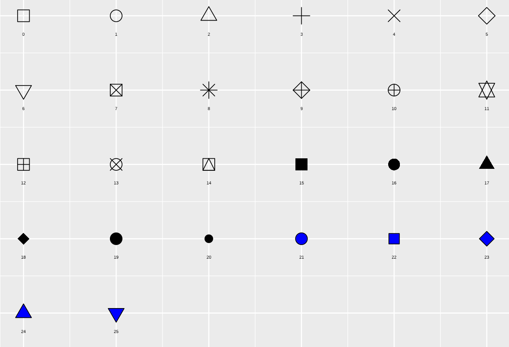

# Basit Veri Görselleştirme

Kitabın 'Neden R?' isimli bölümünde de açıklandığı üzere, aslında R veri görselleştirme noktasında çok kapsamlı çözümler sunabilmektedir. Ancak, bu bölümde yalnızca temel fonksiyonlarla (özellikle `plot()` ile) basit veri görselleştirme üzerine örnekler verilmiştir. İleri düzey veri görselleştirme konusu, odağına veri görselleştirmeyi alan bir başka kitaba bırakılmıştır.

## plot() Fonksiyonu ve Grafik Türleri

<code>plot()</code> fonksiyonu ile temel düzeyde bir veri görselleştirmesi yapılabilir. Bu fonksiyon, çok temel argümanlar ile hızlıca görselleştirme yaparak veriyi incelemeye olanak sağlar.

```{r}
# x ve y vektörlerini oluşturma (200 gözlem)
x <- rnorm(200)
y <- x + rnorm(200)

# basit bir görselleştirme
plot(x, y)
```

<code>plot()</code> fonksiyonu ile bu saçılım grafiği (scatter plot) haricinde farklı grafik türlerinde de veri görselleştirmesi yapılabilir.

```{r}
# örnek uygulama yapabilmek adına veri setlerinin ve bir fonksiyonun üretilmesi
x <- rnorm(200)
y <- x + rnorm(200)
faktor <- factor(mtcars$cyl)
fonksiyonM <- function(x) x^2 + 1

# grafiklerin birlikte gösterilmesi için (2 satır, 2 sütun olacak şekilde)
par(mfrow = c(2, 2))

# saçılım grafiği
plot(x, y)

# sütun grafiği
plot(faktor)

# kutu grafiği
plot(faktor, rnorm(32))

# verilen bir fonksiyonun grafiği
plot(fonksiyonM, 0, 10)

# korelasyon tablosunun görselleştirilmesi
plot(iris[, 1:4])

# grafiklerin yine eskisi gibi tek başına gösterilmesi için, az önce yapılan ayarın düzeltilmesi gerekiyor
par(mfrow = c(1, 1))
```

Örneklerden görüldüğü üzere <code>plot()</code> fonksiyonu kendisine verilen veri setine göre düzenlemeyi kendi yapmaktadır. Örneğin, sütun grafiği çizilirken <code>plot()</code> fonksiyonu içine herhangi bir ek argüman girilmemesine karşın, fonksiyon elindeki veri setinden bir sütun grafiği oluşturması gerektiğini anlamaktadır. Çünkü verilen veri seti faktör türündedir. Benzer şekilde, iki sürekli değişken verildiğinde <code>plot()</code> fonksiyonu bir saçılım grafiği oluşturacaktır.

<code>plot()</code> fonksiyonu ile oluşturulacak grafiğin türü <code>type</code> argümanı ile belirlenebilir.

```{r}
# örnek uygulama yapabilmek adına veri setlerinin üretilmesi
x <- 1:15
y <- c(3, 4, 7, 11, 8, 9, 14, 2, 3, 4, 5, 6, 7, 10, 10)

# grafiklerin birlikte gösterilmesi için (1 satır, 3 sütun olacak şekilde)
par(mfrow = c(1, 3))

plot(x, y, type = "l")
plot(x, y, type = "s")
plot(x, y, type = "p")

# grafiklerin yine eskisi gibi tek başına gösterilmesi için, az önce yapılan ayarın düzeltilmesi gerekiyor
par(mfrow = c(1, 1))

# grafiklerin birlikte gösterilmesi için (1 satır, 3 sütun olacak şekilde)
par(mfrow = c(1, 3))

plot(x, y, type = "o")
plot(x, y, type = "b")
plot(x, y, type = "h")

# grafiklerin yine eskisi gibi tek başına gösterilmesi için, az önce yapılan ayarın düzeltilmesi gerekiyor
par(mfrow = c(1, 1))

# grafiklerin birlikte gösterilmesi için (1 satır, 3 sütun olacak şekilde)
par(mfrow = c(1, 3))

plot(x, y, type = "c")
plot(x, y, type = "S")
plot(x, y, type = "n")

# grafiklerin yine eskisi gibi tek başına gösterilmesi için, az önce yapılan ayarın düzeltilmesi gerekiyor
par(mfrow = c(1, 1))
```

<code>plot()</code> fonksiyonunda type argümanına dokuz farklı değer girilebilir. Bu argümanın değerleri l, s, p, o, b, h, c, S ve n olabilir. Her bir tür yukarıda örneklendirilmiştir. Sadece 's' ve 'S' değerleri aynı grafiklerin oluşmasına neden olmuştur. Ancak, ikisi arasında küçük bir fark bulunmaktadır. 's' değeri kullanıldığında değerler (x1, x2)'den (y1, y2)'ye giderken önce yatay, sonra dikey çizgiler çizilirken, 'S' değeri kullanıldığında önce dikey, sonra yatay çizgiler çizilecektir.

## Noktaların Şekli: pch Argümanı

<code>plot()</code> fonksiyonunun için <code>pch</code> argümanı girilerek gösterimi yapılan noktaların şekli değiştirilebilir.

```{r}
x <- 1:10
y <- sample(x = 10:50, size  = 10)

plot(x, y)
plot(x, y, pch = 23)
plot(x, y, pch = 24)
```

<code>pch</code> argümanına ek olarak eklenebilecek <code>col</code> argümanı ile noktaların rengi, <code>cex</code> argümanı ile noktaların büyüklüğü, <code>bg</code> argümanı ile noktaların dışındaki şeklin rengi ve <code>lwd</code> argümanı ile bu şeklin kalınlığı ayarlanabilir.

```{r}
x <- 1:10
y <- sample(x = 10:50, size  = 10)

plot(x, y, pch = 24, col = "red", cex = 2.5, bg = "blue", lwd = 3)
```

`pch` argümanına girilebilecek değerler aşağıdaki görselde verilmiştir.

<center>{width="200%"}</center>

## Grafiğin Başlığı ve Alt Başlığı

Grafiklere bir başlık ve alt başlık eklenebilir. Bunun için <code>plot()</code> fonksiyonunun için <code>main</code> ve <code>sub</code> argümanları girilmelidir.

```{r}
x <- 1:10
y <- sample(x = 10:50, size  = 10)

plot(x, y, pch = 24, main = "Ana Başlık", sub = "Alt Başlık ya da Açıklama")

# adj argümanı ile başlığın yeri değiştirilebilir
plot(x, y, pch = 24, main = "Ana Başlık", adj = 0.75)

# Başlıkta matematiksel gösterimle tercih edilirken expression() fonksiyonundan yararlanılabilir
plot(x, y, pch = 24, main = expression(alpha[1] ^ 2 + frac(beta, 2) - pi*delta - epsilon + gamma^zeta - frac(eta, mu)))
```

## Eksenler

Grafik çizilirken yatay eksenin ismi x vektörünün, dikey eksenin ismi ise y vektörünün ismi olarak alınır. Ancak kullanıcı isterse bu eksenlerin ismini <code>xlab</code> ve <code>ylab</code> argümanları ile değiştirebilir.

```{r}
x <- 1:10
y <- sample(x = 10:50, size  = 10)

plot(x, y, xlab = "Yatay", ylab = "Dikey")
```

Eksenlerin isminin görünmemesi istendiğinde tırnak işaretlerinin içi boş bırakılır.

```{r}
x <- 1:10
y <- sample(x = 10:50, size  = 10)

plot(x, y, xlab = "", ylab = "")

# ann argümanına FALSE değeri girilerek de eksen isimleri devre dışı bırakılabilir
plot(x, y, xlab = "Yatay", ylab = "Dikey", ann = FALSE)
```

Eksenlerde yer alan değerler <code>xaxt</code> ve <code>yaxt</code> argümanları ile silinebilir.

```{r}
x <- 1:10
y <- sample(x = 10:50, size  = 10)

par(mfrow = c(1, 3))
plot(x, y, xaxt = "n")
plot(x, y, yaxt = "n")
plot(x, y, xaxt = "n", yaxt = "n")

par(mfrow = c(1, 1))
```

Eksenlerde yer alan değerlerin yönü <code>las</code> argümanı ile düzenlenebilir.

```{r}
x <- 1:10
y <- sample(x = 10:50, size  = 10)

par(mfrow = c(2, 2))

plot(x, y, las = 0)
plot(x, y, las = 1)
plot(x, y, las = 2)
plot(x, y, las = 3)

par(mfrow = c(1, 1))
```

Örneklerde görüldüğü üzere x ve y ekseninde gösterilen değerler las argümanının aldığı değere göre yön değiştirmektedir.

Eksenlerin limitleri <code>xlim</code> ve <code>ylim</code> argümanları ile düzenlenebilir.

```{r}
x <- 1:10
y <- sample(x = 10:50, size  = 10)

plot(x, y, xlim = c(10, 60), ylim = c(0, 10))
```

## Yazı Tipi Ayarları

<code>cex.main</code>, <code>cex.sub</code>, <code>cex.lab</code> ve <code>cex.axis</code> argümanları ile grafiğin başlığının, alt başlığının, eksen isimlerinin ve eksen değerlerinin büyüklükleri değiştirilebilir.


```{r}
x <- 1:10
y <- sample(x = 10:50, size  = 10)

plot(x, y, main = "Ana Başlık", sub = "Alt Başlık ya da Açıklama",
     cex.main = 3,
     cex.sub = 1.2,
     cex.lab = 2,
     cex.axis = .75)

```

<code>font</code> argümanı ile yazı tipi kalın, eğik ve hem kalın hem eğik olarak ayarlanabilir. Bu ayar ile başlık, alt başlık gibi kısımlarda bir değişiklik olmaz.

```{r}
x <- 1:10
y <- sample(x = 10:50, size  = 10)

par(mfrow = c(1, 3))

plot(x, y, font = 2, main = "Kalın")
plot(x, y, font = 3, main = "Eğik")
plot(x, y, font = 4, main = "Hem Kalın Hem Eğik")

par(mfrow = c(1, 1))
```

Diğer kısımların yazı tiplerini değiştirmek için <code>font.main</code>, <code>font.sub</code>, <code>font.lab</code> ve <code>font.axis</code> argümanları kullanılabilir.

```{r}
x <- 1:10
y <- sample(x = 10:50, size  = 10)

plot(x, y, main = "Başlık", sub = "Alt Başlık",
     font.main = 1,
     font.sub  = 2,
     font.axis = 3,
     font.lab  = 4)
```

Görüldüğü üzere 1 değeri düz yazı tipini, 2 değeri kalın, 3 değeri eğik ve 4 değeri hem kalın hem eğik yazı tipini ifade etmektedir.
<code>text</code> argümanı ile grafiğin içine yazı/metin eklenebilir.

```{r}
x <- 1:10
y <- sample(x = 10:50, size  = 10)

plot(x, y)
text(2, 15, "Metin")
text(5, 35, "Diğer Metin")
```

<code>text</code> argümanının içine girilen değerler koordinatları ifade etmek içindir. Örneğin 2 ve 15 değerleri girildiğinde x = 2, y = 15 noktasına karşılık gelen noktaya ilgili metin yazdırılacaktır. Ek olarak, <code>family</code> argümanı kullanılarak yazı tipi değiştirilebilir.

```{r}
x <- 1:10
y <- sample(x = 10:50, size  = 10)

plot(x, y)
text(2, 15, "Metin", family = "serif")
text(5, 40, "Diğer Metin", family = "mono")
```

## Renklendirme

Grafik üzerindeki noktaların/çizgilerin renkleri <code>plot()</code> fonksiyonunun içine girilecek <code>col</code> argümanı ile düzenlenebilir.

```{r}
id <- 1:24
cinsiyet <- rep(c("Kiz", "Erkek"), 12)
puan <- sample(x = 50:100, size  = 24)

data_sinif <- data.frame(id, cinsiyet, puan)

plot(id, data_sinif$puan, col = "orange")
```

Farklı gruplara göre grafik üzerindeki renkler gruplandırılabilir.

```{r}
plot(id, data_sinif$puan, col = factor(cinsiyet, levels = c("Kiz", "Erkek")))
```

Özel bir ayarlama yapılmadığı sürece R, gruplara göre renklendirmeyi kendi olağan ayarlarına göre yapacaktır. Bu noktada, kullanıcı isterse seçtiği renklerle grafiği çizdirebilir.

```{r}
renkler1 <- c("red", "blue")
plot(id, data_sinif$puan, col = renkler1[factor(cinsiyet, levels = c("Kiz", "Erkek"))])
```

R'da ayrıca renkler için HEX kodları da kullanılabilir. Yani 'green', 'red', 'blue' gibi renkler dışında HEX kodunu bildiğiniz bir rengi de grafiklerde kullanabilirsiniz.

```{r}
renkler2 <- c("#00B5A7", "#FF80FB")
plot(id, data_sinif$puan, col = renkler2[factor(cinsiyet, levels = c("Kiz", "Erkek"))])
```

<div class="warning" style='background-color:#D3EEFF; color: #003E64; border-left: solid #003E64 4px; border-right: solid #003E64 4px; border-radius: 4px; padding:0.7em;'>
<span>
<p style='margin-top:1em; text-align:center'>
<center><p>`r fontawesome::fa('circle-info',fill='#003E64', height = '2.5em')`</p></center>
<b>Hex Renk Kodu</b></p>
<p style='margin-left:1em;'>
HEX renk kodları, HTML renk kodlarının bir türüdür ve 'hexadecimal color' ya da kısaca 'HEX' olarak bilinirler. Bu kodlar # işareti ile başlar ve devamında 6 adet rakam ya da harf bulunur. Bu rakam ve harflerden ilk ikisi kırmızı; sonraki ikisi yeşil ve son ikisi mavi rengi işaret eder. Bu üç renk için renk değerleri 00 ile FF arasında değişmektedir. Örneğin beyaz rengin kodu #FFFFFF iken, siyah rengin kodu #000000'dır. Renk kodlarına Google'da kısa bir araştırma yaparak ulaşabilirsiniz. Pek çok yerde kullanılan bu renk kodları, R'da özellikle grafik oluştururken kullanılabilir. Bu noktada örneğin, kurumunuzun renk paletindeki renkleri grafiğinizi renklendirmek için kullanabilirsiniz. Benzer şekilde bu renkler ile çeşitli dokümanlar ve web siteleri de oluşturulabilir.
</p>
</span>
</div>

Grafiğin arka planının rengi değiştirilebilir. Bunun için <code>plot()</code> fonksiyonu çalıştırılmadan önce <code>par()</code> fonksiyonu içinde <code>bg</code> argümanına istenen değer girilerek çalıştırılmalıdır.

```{r}
x <- 1:10
y <- sample(x = 10:50, size  = 10)

# arka plan açık mavi olacaktır
par(bg = "#CCF9FF")

# grafik (noktalar mor renkli olacaktır)
plot(x, y, col = "#8300FF", pch = 16)

# eski rengine tekrar döndürmek için
par(bg = "white")
```

## Çizgi Ekleme

<code>plot()</code> fonksiyonu ile çizdirilen bir grafiğin üzerine <code>lines()</code> fonksiyonu ile çizgi (doğru parçası) çizilebilir.

```{r}
x <- 1:10
y <- sample(x = 10:50, size  = 10)

plot(x, y)
lines(1:10, 30:39)
```

<code>lwd</code> argümanı ile çizginin kalınlığı, <code>col</code> argümanı ile de çizginin rengi değiştirilebilir.

```{r}
x <- 1:10
y <- sample(x = 10:50, size  = 10)

plot(x, y)
lines(1:10, 30:39, lwd = 4, col = "red")
```

<code>lty</code> argümanı ile çizginin şekli değiştirilebilir. <code>lty</code> argümanına 0'dan 6'ya kadar yedi farklı değer girilebilir. 1 değeri olağan ayardır ve düz çizgi çizmek için kullanılır. 2 ile kısa çizgili, 3 ile noktalı, 4 ile nokta ve kısa çizgili, 5 ile uzun çizgili ve 6 ile uzun ve kısa çizgili çizgi şekli belirleme yapılabilir.

```{r}
x <- 1:10
y <- sample(x = 10:50, size  = 10)

plot(x, y)
lines(1:10, 30:39, lwd = 4, col = "red", lty = 3)
```

## Metin Ekleme

<code>text()</code> fonksiyonu ile çizdirilen grafiğe metin eklenebilir.

```{r}
x <- 1:10
y <- sample(x = 10:50, size  = 10)

plot(x, y)
text(1, 20, "Metin")
```

<code>text()</code> fonksiyonunun içine girilen iki sayısal değer koordinatları ifade etmektedir. Yukarıdaki örnekte x=1, y=20 olarak belirlenen noktaya 'Metin' ifadesinin yazılması istenmiştir. Ayrıca yine <code>text()</code> fonksiyonu ile veri noktalarının etiketleri yazdırılabilir.

```{r}
x <- 1:10
y <- sample(x = 10:50, size  = 10)

plot(x, y)
text(x, y, pos = 4)
```

## Lejant

<code>legend()</code> fonksiyonu ile grafik alanına lejant girilebilir.

```{r}
x <- 1:10
y <- sample(x = 10:50, size  = 10)

plot(x, y)
lines(1:10, 30:39, lwd = 4, col = "red")
lines(1:10, 40:49, lwd = 4, col = "green")
legend("bottomright", legend = c("aciklama 1", "aciklama 2"),
       lwd = 3, col = c("red", "green"))
```

<code>legend()</code> fonksiyonunun içinde yer alan 'bottomright' ifadesi lejantın sağ altta yer almasının istendiğini gösterir. Bu değer yerine 'top', 'bottom', 'topleft', 'topright', 'bottomleft' ya da 'bottomright' yazılabilir. Bu değerler lejantın sırasıyla üstte, altta, sol üstte, sağ üstte, sol altta ve sağ altta yer alacağını ifade eder.

## Grafik Alanının Çevresi

<code>plot()</code> fonksiyonunun içine girilecek <code>bty</code> argümanı ile grafik alanının çevresinin şekli değiştirilebilir. Bu argümanın değerleri <code>o</code>, <code>l</code>, <code>7</code>, <code>c</code>, <code>u</code>, <code>]</code> veya <code>n</code> olabilir.

```{r}
x <- 1:10
y <- sample(x = 10:50, size  = 10)

par(mfrow = c(2, 3))

plot(x, y, bty = "o", main = "bty = 'o'")
plot(x, y, bty = "l", main = "bty = 'l'")
plot(x, y, bty = "7", main = "bty = '7'")
plot(x, y, bty = "c", main = "bty = 'c'")
plot(x, y, bty = "u", main = "bty = 'u'")
plot(x, y, bty = "]", main = "bty = ']'")

par(mfrow = c(1, 1))
```

<code>bty</code> argümanının içine <code>n</code> (none) girildiğinde grafik alanını çevreleyen bir kutu oluşmaz. Sadece x ve y eksenlerinin değerleri yer alır.

## Alıştırmalar `r fontawesome::fa('pencil',fill='gray')`

**Alıştırma 1**
$x > 0$ için $y = x^3$ fonksiyonunun grafiğini `plot()` fonksiyonunu kullanarak çiziniz.

<details>
  <summary>Yanıt İçin Tıklayınız `r fontawesome::fa('circle-arrow-down',fill='gray')`</summary>

```{r} 
fonksiyonA <- function(x) x^3
plot(fonksiyonA)
```

</details>

**Alıştırma 2**
`x <- 1:10` ve `y <- sample(x = 10:50, size  = 10)` tanımlamasını yaparak x ve y değerlerine ilişkin grafiği çiziniz ve grafiğin başlığını 'Bu Bir Başlıktır'; alt başlığını/açıklamasını 'Buraya Açıklama Gelecek' olarak belirleyiniz.

<details>
  <summary>Yanıt İçin Tıklayınız `r fontawesome::fa('circle-arrow-down',fill='gray')`</summary>

```{r} 
x <- 1:10
y <- sample(x = 10:50, size  = 10)

plot(x, y, main = "Bu Bir Başlıktır", sub = "Buraya Açıklama Gelecek")
```

</details>

</details>

**Alıştırma 3**
`x <- 1:10` ve `y <- sample(x = 10:50, size  = 10)` tanımlamasını yaparak x ve y değerlerine ilişkin grafiği çiziniz ve x-eksenine 'id', y-eksenine 'Degerler' isimlerini veriniz.

<details>
  <summary>Yanıt İçin Tıklayınız `r fontawesome::fa('circle-arrow-down',fill='gray')`</summary>

```{r} 
x <- 1:10
y <- sample(x = 10:50, size  = 10)

plot(x, y, xlab = "id", ylab = "Degerler")
```

</details>

**Alıştırma 4**
`x <- 1:10` ve `y <- sample(x = 10:50, size  = 10)` tanımlamasını yaparak x ve y değerlerine ilişkin grafiği çiziniz ve `text()` fonksiyonu yardımıyla (5, 25) noktasına 'XXX' ifadesini yazdırınız.

<details>
  <summary>Yanıt İçin Tıklayınız `r fontawesome::fa('circle-arrow-down',fill='gray')`</summary>

```{r} 
x <- 1:10
y <- sample(x = 10:50, size  = 10)

plot(x, y)
text(5, 25, "XXX")
```

</details>