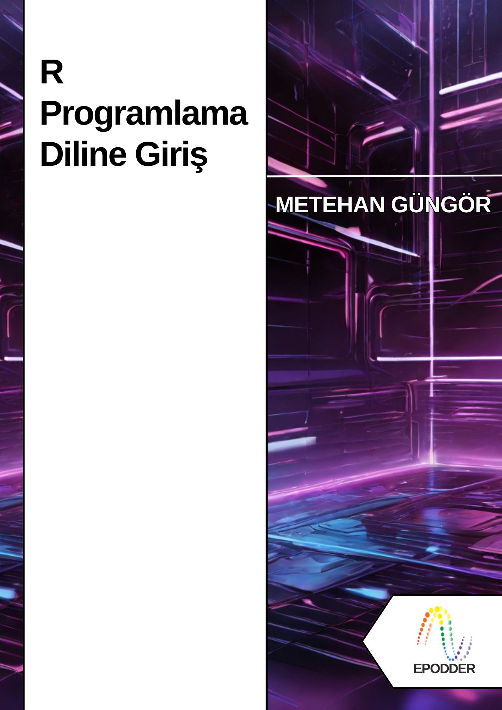
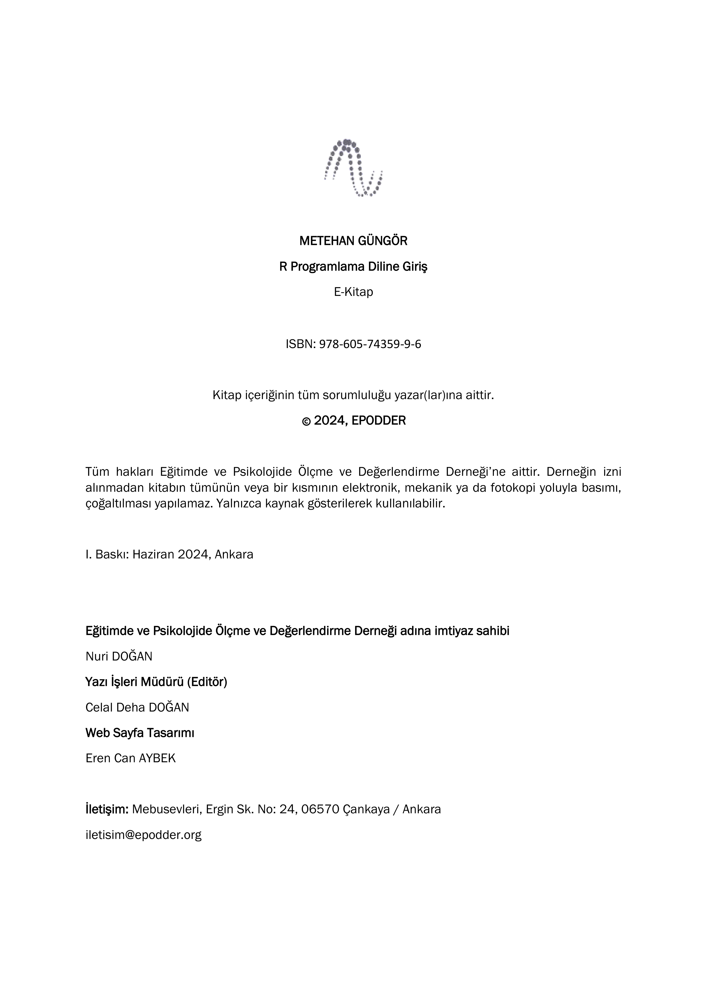

--- 
title: "R Programlama Diline Giriş"
author: "Metehan GÜNGÖR"
date: "`r Sys.Date()`"
site: bookdown::bookdown_site
documentclass: book
bibliography: [book.bib, packages.bib]
# url: your book url like https://bookdown.org/yihui/bookdown
# cover-image: path to the social sharing image like images/cover.jpg
description: |
  This is a minimal example of using the bookdown package to write a book.
  The HTML output format for this example is bookdown::gitbook,
  set in the _output.yml file.
link-citations: yes
github-repo: rstudio/bookdown-demo
---


```{r xaringanExtra-clipboard, echo=FALSE}
htmltools::tagList(
  xaringanExtra::use_clipboard(
    button_text = "<i class=\"fa fa-clipboard\" style=\"color: #E7E7E7\"></i>",
    success_text = "<i class=\"fa fa-check\" style=\"color: #90BE6D\"></i>",
    error_text = "<i class=\"fa fa-times-circle\" style=\"color: #F94144\"></i>"
  ),
  rmarkdown::html_dependency_font_awesome()
)
```
# **KAPAK** {.unnumbered}



# **KÜNYE** {.unnumbered}




# Sunuş {-}

Veri analizi, veriyi inceleme, temizleme, dönüştürme ve modelleme süreçlerini içeren geniş kapsamlı bir terimdir. Veri analizi sürecinde çeşitli teknikler ve yaklaşımlar kullanılabilmektedir. Özellikle sosyal bilimler alanında çalışan araştırmacılar, alanlarına özgü pek çok teknikle çeşitli istatistiksel modellemeler yapmaktadır. Bilgisayar ve yazılım alanlarındaki gelişmeler, günümüzdeki veri analizi sürecini önemli ölçüde etkilemiştir. Bu süreçte ortaya çıkan gelişmeler, geçmişin sınırlı şartlarında ortaya konan bilimsel çalışmaların kalitesini artırmıştır. Günümüzde istatistiksel analizler için çözümler üreten ücretli paket programlar, o günlerden bu yana geliştirilmektedir ancak günümüz veri analizi yaklaşımı açısından sınırlı bir perspektif sunmaktadır. Bu nedenle çözümler de sınırlıdır. Bu noktada özgür bir yazılım olan R ön plana çıkmaktadır.

R, bir programlama dilidir. Özellikle istatistiksel analiz ve veri görselleştirme konusunda çözümler sunuyor olması onun güçlü yanlarındandır. Oldukça geniş bir kitle tarafından kullanılan bu yazılım, topluluk yardımı sayesinde sürekli gelişmektedir. Çeşitli kişilerin geliştirdiği paketler yardımıyla bu programda pek çok analiz gerçekleştirilebilir. Dahası, kullanıcı başkaları tarafından geliştirilmiş fonksiyonları kendi amacına hizmet edecek şekilde özelleştirebilir, planladığı analizi defalarca yazılıma tekrarlatabilir, sonuçları özet şeklinde bilgisayarına kaydedebilir. R sunduğu geniş imkanlar ve görece kolay öğrenilebilecek dili nedeniyle tercih edilebilir bir popüler yazılım olarak görülmektedir. Bu nedenle bu kitap, R’da veri analizine başlamak isteyenlere yol göstermeyi amaçlamıştır.

Günümüzde internet sayesinde R ile programlamaya giriş ile ilgili pek çok kaynağa ulaşılabilir. Ancak, bu kitapta kendi öğrenme deneyimimden yola çıkarak birkaç noktaya özen göstermeye gayret ettim. Bunları okurla paylaşmak isterim:
<li>Uygulamalar öncesinde örnek basit veri setini uygulamanın hemen öncesinde, kolay okunabilir kodlarla ürettim. Böylelikle okur, kullanılan veri setini kitabın farklı sayfalarında aramak zorunda kalmasın istedim.</li>
<li>Uygulamaları temel paketlerle ve fonksiyonlarla gerçekleştirdim. Çünkü, bazı popüler paketlerdeki fonksiyonlar ve argümanlar yeni güncellemelerde değişebiliyor.</li>
<li>Uygulamalarda özellikle birden fazla aşama var ise kodların üzerine # işareti ile açıklamalar ekledim.</li>
<li>R’da bazı temel fonksiyonları bilmek önemlidir. Ancak R’daki tüm fonksiyonları bir kitapta açıklamak da mümkün değildir. Bu nedenle, mümkün olduğunca işe yarayabilecek fonksiyonları da kullanmaya çalıştım. Böylelikle farklı bir fonksiyonun nasıl bir işlem yaptığını görme fırsatı da bulabilir okurlar.</li>
<li>Kitaptaki uygulamaların basitten karmaşığa gitmesini sağlamaya gayret ettim ve bu süreçte gereksiz, kafa karıştırıcı kodları kullanmadım.</li>
<li>Örnek veri setlerini, tamamen anlamsız şekilde üretmek yerine, mümkünse gerçek bir durumu örnekleyebilecek şekilde üretmeye özen gösterdim.</li>
<li>e-kitap şeklinde yayımlanan bu kitapta, okurların internetten de faydalanabilmesi için link’ler ekledim.</li>
<li>Kitap ile ilgili bir [GitHub repository](https://github.com/gungorMetehan/R-programlama-diline-giris)’si oluşturdum. Böylelikle okur, gereksinim duyduğu anlarda bu kısma da başvurabilir.</li>
<li>Yeni başlayanlar için, uygun olan her bölümün sonuna alıştırma soruları ekledim. Alıştırmalar, yeni başlayanların kodları doğrudan kopyala-yapıştır yaparak çalıştırması yerine kendi kodlarını yazmaya çabalamalarını teşvik etmeyi amaçlamakta.</li>
<li>R’da yaygın karşılaşılan hata ve uyarı mesajları için bir bölüm ekledim. Yeni başlayanlara R’da kodlama serüveninde sıklıkla karşılaşacakları hatalar ve uyarılar konusunda farkındalık kazandırmayı amaçladım.</li>
<li>R ile ilgili ne kadar çok kaynak taranırsa o kadar çok farklı örneğe rastlanabileceği için bir de okuma önerileri hazırladım.</li>
R yazılımı ile ilgili başlangıç seviyesindeki bilgiler bu kitap aracılığı ile derlenmeye çalışılmıştır. Tabi, bu konuya bir sınır çizmek de mümkün değildir. Bu nedenle, siz değerli okuyucuların görüş ve önerileri, kitabın yeni baskıları için çok önemlidir. Kitap ile ilgili yazara iletmek istediğiniz her şey için <code>gungormetehan@gmail.com</code> adresine e-posta atabilirsiniz.

Yararlı olması dileğiyle.

<p style='text-align: right;'>**Metehan GÜNGÖR**</p>
<p style='text-align: right;'>Haziran, 2024</p>

## Yazar Hakkında {-}

<link rel="stylesheet" href="https://cdn.jsdelivr.net/gh/jpswalsh/academicons@1/css/academicons.min.css">

<br>
</br>
<div class="alert alert-warning" role="alert">
  <p>
**Uzm. Metehan GÜNGÖR**
<br>
</br>
1991 yılında Daday’da doğmuştur. İlk ve orta öğrenimi Türkiye’nin doğusundan batısına farklı şehirlerde tamamlamıştır. Lisans eğitimini Samsun Ondokuz Mayıs Üniversitesi Ortaöğretim Fen ve Matematik Alanları Eğitimi Ortaöğretim Matematik Öğretmenliği bölümünde, yüksek lisans eğitimini ise Hacettepe Üniversitesi Eğitim Bilimleri Enstitüsü Eğitimde Ölçme ve Değerlendirme programında tamamlamıştır. Şu anda Ankara Üniversitesi Eğitim Bilimleri Enstitüsü Eğitimde Ölçme ve Değerlendirme Bilim Dalı’nda doktora öğrencisidir ve tez aşamasındadır. Sivil toplum projelerinde hem gönüllü hem profesyonel olarak çalışan Güngör, bu projelerde eğitmenlik, eğitmen eğiticiliği ve koordinatörlük görevlerini yürütmüştür. Özel bir kolejde ölçme ve değerlendirme uzmanı olarak çalışmış olan Güngör, K-12 düzeyinde kazandığı deneyimlerin ardından bir kurumsal akademiye geçmiş ve ölçme ve değerlendirme uzmanı olarak çalışmaya başlamıştır. Türk Havacılık ve Uzay Sanayii AŞ’nin akademisinde çalışmaya devam etmektedir.
</p>
<br>
</br>
<center>[<i class="ai ai-orcid-square ai-3x"></i>](https://orcid.org/0000-0003-4409-2229)     [<i class="ai ai-researchgate-square ai-3x"></i>](https://www.researchgate.net/profile/Metehan-Guengoer)     [<i class="ai ai-google-scholar-square ai-3x"></i>](https://scholar.google.com/citations?hl=tr&user=A2t06HsAAAAJ)     [<i class="ai ai-academia-square ai-3x"></i>](https://independent.academia.edu/gungormetehan)</center>
</div>

## Açıklamalar {-}

Bu kitabın oluşturulmasındaki tüm kodlar iki farklı bilgisayarda çalıştırılmıştır. Kullanılan bilgisayarların özellikleri şunlardır:
<li>Bilgisayar 1: Victus by HP Laptop 16-e0xxx, AMD Ryzen 7 5800H with Radeon Graphics (16 CPUs – ~3.2GHz), Windows 11 Home İşletim Sistemi</li>
<li>Bilgisayar 2: ABRA A5 V18.2 Monster, 11th Gen Intel(R) Core(TM) i7-11800H (16CPUs - ~2.3GHz), Windows 10 Enterprise 64-bit</li>

Yazılım ile ilgili kitaplarda, kullanılan yazılımların versiyonlarının bilinmesi önemlidir. Bu kitapta R'ın "R version 4.3.2 (2023-10-31 ucrt)" versiyonu kullanılmıştır. Kullanılan IDE'nin versiyonu ise RStudio 2022.07.2+576 "Spotted Wakerobin" Release'dir.

Bu kitap hazırlanırken R yazılımı, RStudio tümleşik geliştirme ortamı (IDE) ile birlikte kullanılmıştır. Bu ortamın sunduğu arayüz kitaptaki görsellerden fark edilmiş olabilir. RStudio’yu ilk defa bilgisayarına kuranlar beyaz ağırlıklı bir görünüm ile karşılaşılacaklardır. Bu görünüm RStudio’da Tools > Global Options… > Appearance kısmından değiştirilebilir. Merak edenler için, benim kullandığım ayarlar şu şekildedir:
<li>RStudio theme: Sky</li>
<li>Zoom: 100%</li>
<li>Editor font: Lucida Console</li>
<li>Text rendering: (Default)</li>
<li>Editor font size: 10</li>
<li>Help panel font size: 10</li>
<li>Editor theme: Tomorrow Night</li>
RStudio’da ayrıca panellerin yerleşimi de ayarlanabilmektedir. Eğitim videolarında sıklıkla gördüğünüz üzere sol üstte kodların yazıldığı bir kaynak paneli, sol altta konsol, sağ üstte çalışma alanı ve sağ altta elde edilen grafiklerin, belgeleri, vb. görüntülenebildiği bir kısım yer almaktadır. Bu panellerin yerleşimi Tools > Global Options… > Pane Layout kısmından değiştirilebilir. Merak edenler için, tercih ettiğim panel yerleşimi şu şekildedir:
<li>Sol üst: Source</li>
<li>Sol alt: Console</li>
<li>Sağ üst: Environment, History, Connections, Build, VCS, Tutorial</li>
<li>Sağ alt: Files, Plots, Packages, Help, Viewer, Presentations</li>

Kitapta yer alan ikonlar (icons) bu konuda oldukça yaygın kullanılan ve güzel ikonlar sunan [`FontAwesome`](https://fontawesome.com/)'dan alınmıştır.